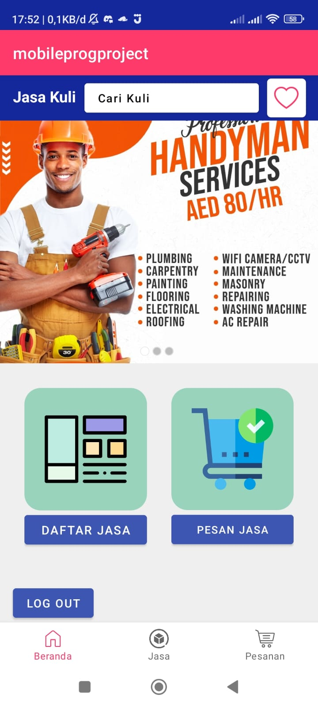
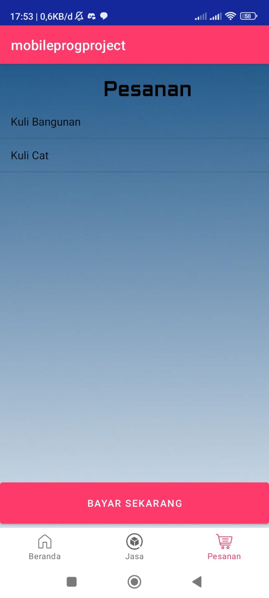

# MobileHandyman
Aplikasi Pencarian Jasa Kuli berbasis Android Studio

## Pengembang

                        4E - Informatika
                Universitas Singaperbangsa Karawang
    untuk memenuhi tugas akhir mata kuliah rekayasa perangkat lunak

## Gambaran Aplikasi
|  |  |  |
|:------------------------:|:------------------------:|:------------------------:|
